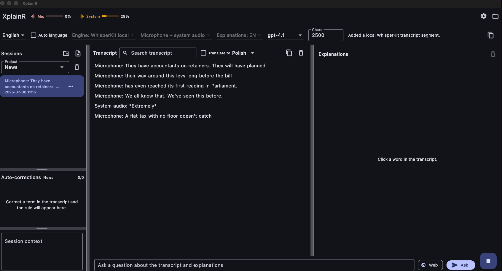
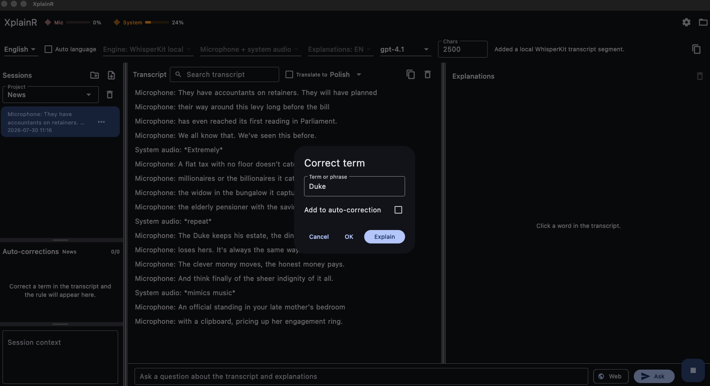
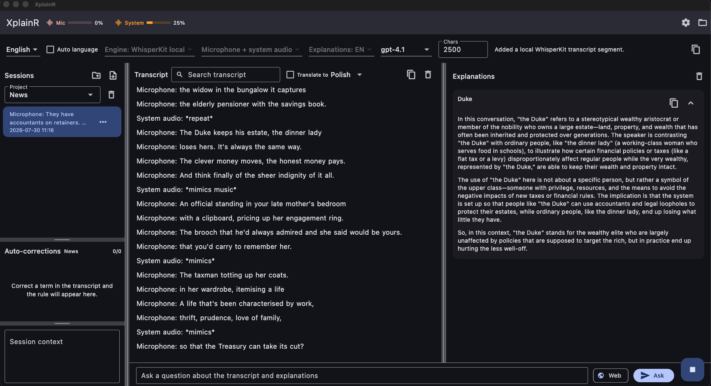
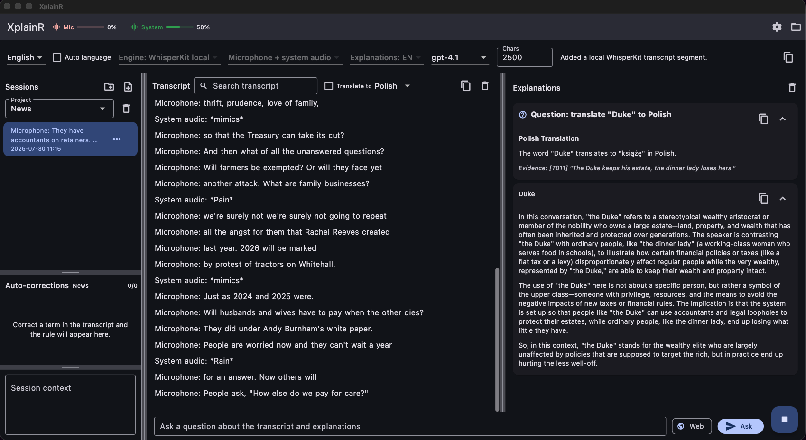
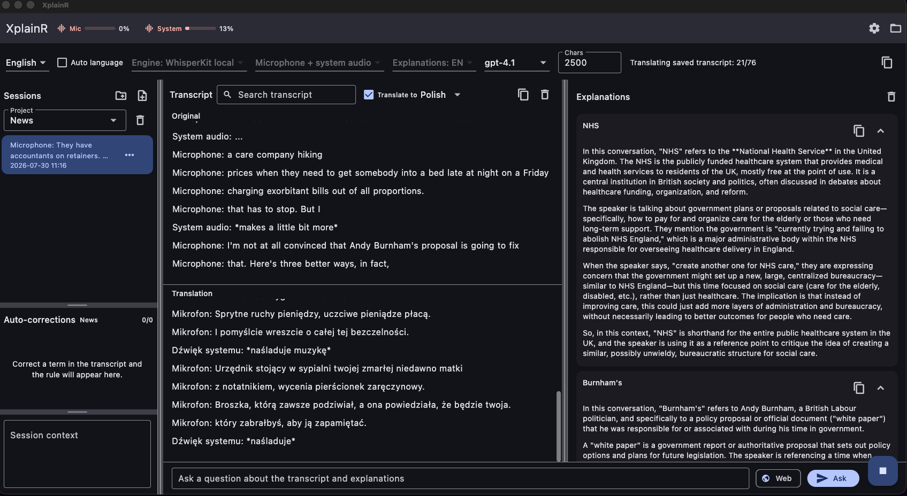
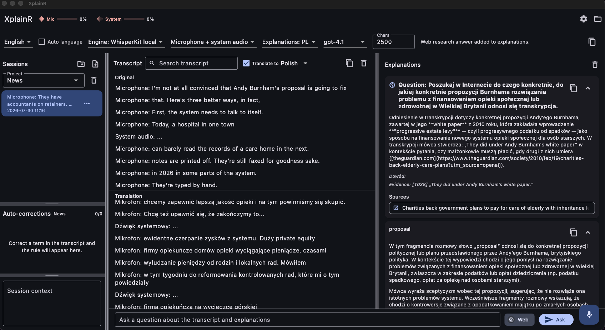
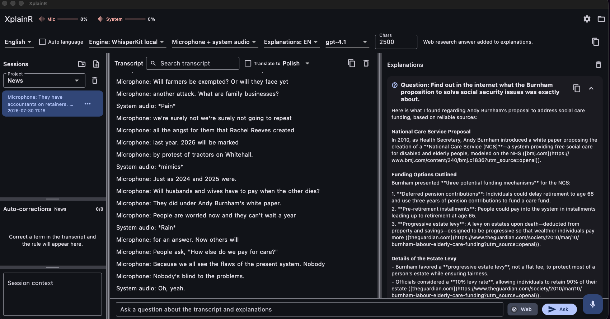
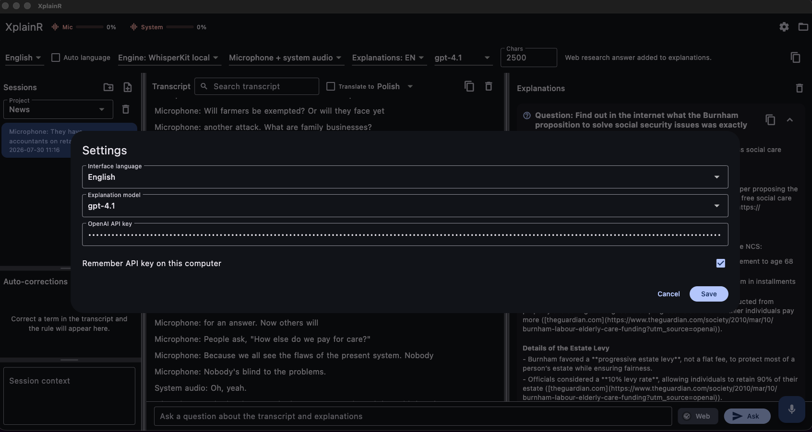

# XplainR

Desktop assistant for live transcription and technical explanations.

XplainR can transcribe live audio from the microphone, system audio, or both
sources at the same time. It stores sessions locally, supports transcript
search, term corrections, project-specific auto-corrections, transcript
translation, contextual explanations, and questions over the saved transcript.

## Screenshots

### Live local transcription

Main workspace with Local WhisperKit selected, simultaneous microphone and
system audio levels, a project session list, live transcript, and the
explanations panel.



### Term correction

Clicking a transcript word opens a correction dialog where the selected term can
be edited, optionally saved as an auto-correction rule, or sent for explanation.



### Contextual explanations

XplainR explains selected transcript terms in the context of the surrounding
conversation instead of returning a generic dictionary definition.



### Questions over the transcript

The question bar can ask about the saved transcript and previous explanations,
with answers kept in the explanation history.



### Transcript translation

The transcript view can split into original and translated text, translating the
saved session while new transcript fragments continue to arrive.



### Web research answers in Polish

For current or external facts, the Web option can enrich transcript-grounded
answers with cited sources and return the result in Polish.



### Web research answers in English

The same transcript question workflow can answer in English and cite web sources
when external context is needed.



### Settings

The settings dialog controls the interface language, explanation model, OpenAI
API key storage, and related preferences.



## Transcription engines

XplainR supports two live transcription engines:

- Apple Speech, using the platform speech recognizer.
- Local WhisperKit, using a local OpenAI-compatible WhisperKit server.

When Local WhisperKit is selected, XplainR starts the local server
automatically if it is not already running:

```text
whisperkit-cli serve --host 127.0.0.1 --port 50060
```

The app sends audio chunks to:

```text
http://127.0.0.1:50060/v1/audio/transcriptions
```

## Dependencies

Required for the Local WhisperKit transcription engine:

- `whisperkit-cli` available on `PATH`, or
- `WHISPERKIT_CLI_PATH` pointing to the executable.

If the server is already running on port `50060`, XplainR reuses it. If XplainR
starts the server itself, it stops that managed process when the app closes.

## Tested environment

The app was tested on a MacBook M1 Pro with 16 GB RAM.

## Installation

Download the latest macOS DMG from
[GitHub Releases](https://github.com/cjkepinsky/XplainR-now-I-get-it/releases),
open it, and drag `XplainR.app` to `Applications`.

The public DMG is ad-hoc signed but not notarized with an Apple Developer ID, so
macOS Gatekeeper may require opening the app from Finder with Control-click,
then Open.

## Development

```text
flutter analyze
flutter build macos
```

## License

This repository is source-available under the XplainR Source-Available
Evaluation License 1.0. Recruiters may review, clone, and run the app locally
for candidate evaluation, but commercial use, resale, redistribution, hosted
use, and product integration require separate written permission.

See [LICENSE](LICENSE) for details.
